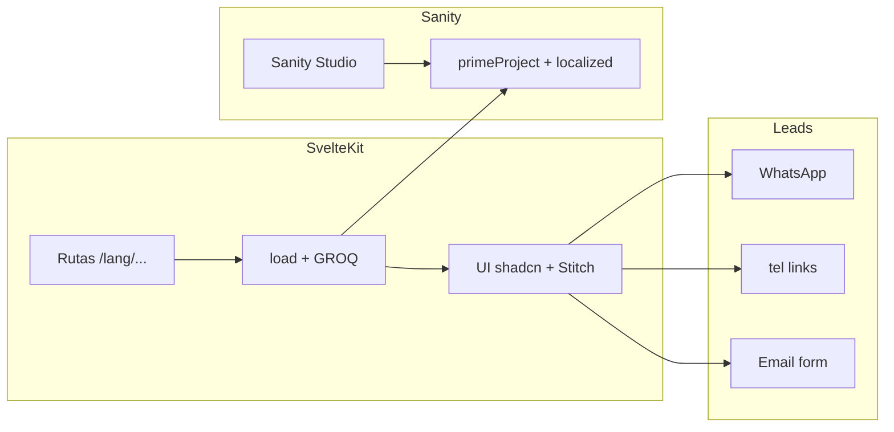

# PrimeHaus — Plan técnico (plantilla actual + Sanity)

Proyecto web inmobiliario premium **PrimeHaus**: SvelteKit 5 (runes) + Sanity.io como CMS, multilingüe ES/EN/FR/DE, enfoque lead generation (sin buscador ni filtros). Diseño a integrar desde `diseño/` (Stitch + `diseño/architectural_prestige/DESIGN.md`).

### Uso en otro IDE / comparativa entre agentes

Este archivo es el **único briefing**: clona el mismo repo (misma rama/commit), pega o adjunta `PLAN.md` y pide ejecutar **un bloque a la vez** (A → G) sin saltar pasos.

- Lee también `AGENTS.md` en la raíz (reglas del proyecto: componentes UI, i18n, SEO).
- Al cerrar cada bloque: `npm run check` (y `npm run lint` si el agente puede).
- No ampliar alcance (sin buscador, sin filtros, sin CMS distinto de Sanity salvo que el bloque lo diga).
- No commitear secretos; documentar variables en `.env.example` cuando el bloque lo requiera.
- Para comparar agentes/IDEs con criterio objetivo: mismo bloque, mismo commit, mismos comandos de verificación; anotar tiempo, errores de `check`, y si respetó AGENTS.md + límites del bloque.

---

## Contexto del repo

- Stack: Svelte 5 runes, SvelteKit 2, Tailwind v4, shadcn-svelte, adapter Vercel, SEO/AEO (`src/lib/site-pages.ts`, `src/hooks.server.ts`).
- **Sanity**: script `studio`, `@sanity/client`, esquemas en `sanity/schemaTypes/` (hoy `caseStudy` es un “proyecto” de portfolio, no inmobiliario).
- **i18n** hoy: ES/EN vía runes + cookie `portfolio_locale` (`src/lib/i18n/site-locale.ts`) y `hreflang` con **misma URL** para ambos idiomas (`src/routes/+layout.svelte`) — poco escalable a 4 idiomas y peor para SEO internacional.
- **Diseño Stitch**: carpeta `diseño/` (`home_l_architecte`, `proyectos_l_architecte`, `quienes_somos_l_architecte`, `contacto_l_architecte`, `blog_l_architecte`, más `diseño/architectural_prestige/DESIGN.md`). Mapear a componentes del catálogo (AGENTS.md), no HTML crudo.
- **CSP** (`src/hooks.server.ts`): ampliar `frame-src` / `img-src` / `connect-src` para embeds (YouTube, Vimeo, Matterport, Sketchfab, etc.) y CDN de Sanity.

---

## Estrategia i18n recomendada (SvelteKit + Sanity)

**Recomendación: rutas con prefijo de idioma** `/(es|en|fr|de)/...` como fuente de verdad del locale (parámetro `lang` en layout):

- Redirección de `/` → `/{defaultLocale}/` (p. ej. `es`) o detección en primera visita (opcional; documentar trade-off).
- Cookie opcional como recuerdo de preferencia que redirija a `/{lang}/` en la siguiente visita.
- **UI strings**: cuatro JSON bajo `src/lib/i18n/`, extendiendo `app-i18n.svelte.ts` y `site-locale.ts` para `fr` y `de`.
- **Contenido Sanity**: extender `localeString` / `localeText` en `sanity/schemaTypes/locale.ts` a **cuatro claves** `es | en | fr | de`. Resolver en front según `lang` de la ruta, fallback ej. `solicitado → en → es`.
- **SEO**: actualizar `supportedLocales` en `src/lib/site-pages.ts`, sitemap con alternates por **URL distinta por idioma**, `hreflang` en layout para `es`, `en`, `fr`, `de`, `x-default`.
- **AEO / twins**: cada nueva ruta según checklist AGENTS.md (`sitePages`, builders, `*.md/+server.ts` si se mantienen twins).

Alternativa solo cookie: válida para MVP interno; **no** recomendada para PrimeHaus con DE/FR (SEO y enlaces compartibles).

---

## Modelo Sanity — documento “Proyecto” (inmobiliaria)

Nuevo tipo (p. ej. `primeProject`) o refactor fuerte de `caseStudy`:

| Campo                      | Tipo propuesto                                                             |
| -------------------------- | -------------------------------------------------------------------------- |
| Nombre                     | `localeString` (4 idiomas)                                                 |
| Zona                       | `localeString`                                                             |
| Descripción                | `localeText` o Portable Text localizado                                    |
| Precio                     | `number` + string opcional moneda / “desde”                                |
| Vídeo embed 3D / recorrido | `url` + opcional proveedor; `<iframe>` o componente dedicado               |
| Galería                    | `array` de `image` (Sanity CDN + `src/lib/server/sanity/image-builder.ts`) |
| CTAs                       | `array`: `label` (localeString), `href` o `tel:` / `mailto:`               |
| Slug                       | `slug` único (compartido entre idiomas)                                    |
| SEO por proyecto           | `localeText` meta description opcional                                     |

Desk: orden por zona/fecha; previews con imagen principal.

---

## Páginas y rutas (sin buscador ni filtros)

| Ruta (bajo `[lang]`)       | Rol                                                |
| -------------------------- | -------------------------------------------------- |
| `/{lang}/`                 | Home: hero, destacados (GROQ), CTAs                |
| `/{lang}/proyectos`        | Listado tarjetas (leads)                           |
| `/{lang}/proyectos/[slug]` | Ficha: galería, vídeo, precio, zona, CTAs          |
| `/{lang}/sobre-nosotros`   | i18n ± opcional Sanity `siteSettings`              |
| `/{lang}/contacto`         | Formulario + click-to-call                         |
| `/{lang}/blog`             | Listado vacío / próximamente + `setSeo`            |
| `/{lang}/blog/[slug]`      | Preparado; 404 o vacío hasta posts Sanity (fase 2) |

Redirecciones desde rutas demo (`/components`, etc.) según producto.

---

## Integraciones lead-gen

- **WhatsApp flotante**: fijo, `https://wa.me/{E164}` sin `+`; texto opcional i18n; datos en `src/lib/site-config.ts` + env si aplica.
- **Click-to-call**: `tel:` internacional en header/footer/ficha.
- **Formulario a email**: action en `+page.server.ts` o route handler; Vercel + **Resend** (o similar), Zod, rate limit básico, honeypot; toasts (`$lib/stores/toast`).

---

## Marca y configuración

- `site-config.ts`, nombre paquete opcional, OG, `JsonLd` Organization.
- Tipografías/colores: `diseño/architectural_prestige/DESIGN.md` + `src/app.css` / tokens.

---

## Riesgos / dependencias

- CSP para iframes y vídeo.
- Env: `SANITY_*`, email, `PUBLIC_WHATSAPP`, `PUBLIC_PHONE`.
- Rutas `[lang]` afectan layout, links, sitemap, hooks, `/api/locale`.

---

## Diagrama (visión)

---

# Bloques de implementación (agentes paso a paso)

## Bloque A — Identidad y configuración base

- Actualizar `site-config` (nombre PrimeHaus, URL final, email, teléfono, WhatsApp, redes).
- Ajustar navegación/footer i18n (claves nuevas).
- Renombrar metadatos por defecto y OG si aplica.

## Bloque B — i18n cuatro idiomas (arquitectura)

- Añadir `fr.json`, `de.json`; extender tipos y `normalizeLocale`.
- Layout `src/routes/[lang]/+layout.ts` (+ `+layout.svelte`) con validación de `lang`.
- Redirección `/` → `/es/` (o default acordado); `resolveRequestLocale` prefiriendo path sobre cookie.
- Actualizar `supportedLocales`, `hreflang`, sitemap con alternates por URL localizada.

## Bloque C — Sanity: esquema inmobiliario y consultas

- Documento `primeProject` (o equivalente) con tabla de campos; `localeString`/`localeText` a 4 idiomas.
- GROQ en `src/lib/server/sanity/` para listado, home destacados y ficha por slug.
- Tipos TS y mapeo a vista.

## Bloque D — Rutas y UI principal (Stitch → componentes)

- Home, listado y ficha desde `diseño/home_l_architecte`, `diseño/proyectos_l_architecte` → Section, Card, Button, Heading, Grid, etc.
- Galería accesible; iframe para vídeo.
- Sobre nosotros y contacto desde `diseño/quienes_somos_l_architecte`, `diseño/contacto_l_architecte`.

## Bloque E — Lead generation (WhatsApp, tel, formulario)

- Componente flotante WhatsApp + `tel:` en header/footer/ficha.
- Formulario contacto: action servidor, email, validación, errores.
- Ajustar CSP si embeds o proveedor de email lo requieren.

## Bloque F — Blog shell + SEO/AEO

- Rutas blog listado/detalle vacías o placeholder traducido.
- `setSeo` + `sitePages` + builders/registry para twins Markdown si se mantienen.
- JSON-LD: `RealEstateAgent` / `LocalBusiness` / `Organization` según copy final.

## Bloque G — Cierre calidad

- `npm run check`, a11y básico, prueba manual 4 idiomas y slugs.
- `.env.example` y notas de despliegue (Vercel + Sanity CORS/orígenes).
