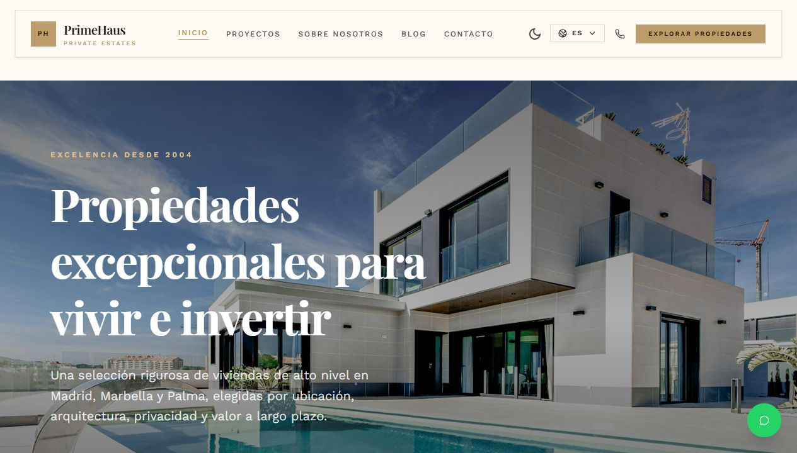

# PrimeHaus

PrimeHaus es una web inmobiliaria premium construida con SvelteKit para presentar propiedades exclusivas en Madrid, Marbella y Palma. El proyecto combina una experiencia visual editorial, catalogo de viviendas, paginas corporativas, blog, contacto privado, SEO tecnico y AEO/GEO para agentes IA.



> Captura tomada sobre la home local de desarrollo el 18 de mayo de 2026.

## Resumen

PrimeHaus esta pensada como una base de producto real para una inmobiliaria boutique: portada con hero inmersivo, navegacion multidioma, catalogo de proyectos, detalle de propiedad, contenido editorial, contacto directo, WhatsApp flotante y una capa avanzada de indexacion para buscadores tradicionales y asistentes IA.

El sitio prioriza:

- Presentacion premium de propiedades y ubicaciones.
- Arquitectura SvelteKit moderna con Svelte 5 runes.
- Componentes reutilizables con shadcn-svelte y utilidades propias.
- Internacionalizacion en ES, EN, FR y DE.
- SEO, Open Graph, JSON-LD, sitemap y robots.
- AEO/GEO con twins Markdown, `llms.txt` y content negotiation.
- Preparacion para despliegue en Vercel.

## Stack

- SvelteKit 2
- Svelte 5
- TypeScript
- Tailwind CSS v4
- shadcn-svelte / bits-ui
- lucide-svelte
- mode-watcher para modo claro/oscuro
- Svelte stores para SEO, i18n y toasts
- Sanity opcional para contenido inmobiliario
- Supabase opcional para integraciones server-side
- Resend para email transaccional
- Vitest, ESLint, Prettier y svelte-check

## Funcionalidades

- Home premium con hero fotografico, CTA, copy multidioma y microinteracciones.
- Catalogo de proyectos inmobiliarios con datos demo.
- Pagina de detalle para cada propiedad.
- Pagina "Sobre nosotros" orientada a marca y confianza.
- Pagina de contacto con acciones directas.
- Blog con articulos editoriales.
- Selector de idioma.
- Modo claro/oscuro.
- WhatsApp flotante.
- Sistema de toasts.
- Componentes base reutilizables: `Button`, `Card`, `Container`, `Section`, `Heading`, `Text`, `Grid`, `HeroSection`, `FeaturesSection`, `Dialog`, `Input`, `Textarea`, `Label`, `Skeleton`, `Spinner` y `Sonner`.
- SEO dinamico mediante `setSeo`.
- JSON-LD automatico con `Organization`, `WebSite`, `BreadcrumbList`, pagina, FAQ, HowTo y SoftwareApplication cuando aplica.
- Endpoints para sitemap, robots, Open Graph dinamico y recursos AEO.

## Rutas principales

| Ruta                | Descripcion                                          |
| ------------------- | ---------------------------------------------------- |
| `/`                 | Home principal de PrimeHaus                          |
| `/proyectos`        | Catalogo de propiedades                              |
| `/proyectos/[slug]` | Detalle de propiedad                                 |
| `/sobre-nosotros`   | Pagina corporativa                                   |
| `/contacto`         | Contacto privado                                     |
| `/blog`             | Indice editorial                                     |
| `/blog/[slug]`      | Articulo de blog                                     |
| `/llms.txt`         | Indice Markdown para LLMs                            |
| `/llms-full.txt`    | Contenido completo del sitio para ingesta IA         |
| `/sitemap.xml`      | Sitemap con rutas indexables                         |
| `/robots.txt`       | Politica de rastreo para crawlers tradicionales e IA |
| `/api/og`           | Imagen Open Graph dinamica                           |

El proyecto tambien incluye rutas con prefijo de idioma bajo `src/routes/[lang]/`.

## SEO, GEO y AEO

La arquitectura SEO usa `src/lib/seo.ts` como punto central. Cada pagina puede llamar a `setSeo({...})` para definir titulo, descripcion, keywords, tipo de schema, FAQ, HowTo y datos de aplicacion.

Desde el layout se inyectan automaticamente:

- `<title>` desde `$seo.title`.
- Meta description, keywords y author.
- Canonical calculado desde la ruta actual.
- Open Graph.
- Twitter Cards.
- `hreflang` para ES, EN, FR y DE.
- Alternates hacia `/llms.txt` y twins Markdown.
- JSON-LD mediante `JsonLd.svelte`.

La capa AEO/GEO esta repartida en:

- `src/lib/site-pages.ts`: registro central de paginas indexables.
- `src/lib/aeo/`: builders, registry, headers y utilidades Markdown.
- `src/routes/llms.txt/+server.ts`: indice estandar para LLMs.
- `src/routes/llms-full.txt/+server.ts`: version extendida del contenido.
- `src/routes/index.md/+server.ts`: twin Markdown de la home.
- `src/hooks.server.ts`: negociacion de contenido para `Accept: text/markdown`, rutas `.md` y crawlers IA.

## Estructura

```txt
src/
  routes/
    +layout.svelte              Layout global, SEO, JSON-LD y providers
    +page.svelte                Home
    [lang]/                     Rutas localizadas
    proyectos/                  Catalogo y detalle de propiedades
    blog/                       Blog y articulos
    contacto/                   Contacto
    sobre-nosotros/             Pagina corporativa
    api/og/                     Open Graph dinamico
    llms.txt/                   Endpoint AEO
    llms-full.txt/              Endpoint AEO completo
    sitemap.xml/                Sitemap
    robots.txt/                 Robots

  lib/
    components/                 Componentes de proyecto
    components/ui/              shadcn-svelte y UI compartida
    data/                       Datos demo de propiedades y blog
    i18n/                       Diccionarios ES, EN, FR y DE
    aeo/                        Builders y utilidades Markdown/AEO
    server/                     Integraciones server-only
    stores/                     Stores de UI
    styles/                     Tokens y estilos Stitch/M3
    seo.ts                      Store y helpers SEO
    site-config.ts              Configuracion general del sitio
    site-pages.ts               Registro de paginas indexables
    reveal.ts                   Accion de animaciones reveal

static/
  primehaus-home-preview.png    Captura usada en este README
  favicon.svg
  manifest.json
```

## Desarrollo local

Requisitos:

- Node.js 22 o superior.
- npm.

Instalacion:

```bash
npm install
```

Servidor de desarrollo:

```bash
npm run dev
```

Servidor accesible en red local:

```bash
npm run dev -- --host 127.0.0.1 --port 5173
```

## Comandos utiles

```bash
npm run check
npm run lint
npm run test
npm run build
npm run preview
npm run format
```

Descripcion rapida:

- `npm run check`: sincroniza SvelteKit y ejecuta `svelte-check`.
- `npm run lint`: comprueba formato y ESLint.
- `npm run test`: ejecuta Vitest.
- `npm run build`: genera la build de produccion.
- `npm run preview`: sirve la build generada.
- `npm run format`: aplica Prettier.

## Variables de entorno

El repositorio incluye `.env.example` como referencia. Revisa ese archivo antes de configurar integraciones reales.

Areas habituales:

- Sanity para contenido.
- Supabase para servicios backend.
- Resend para email.
- Sentry para observabilidad.

No subas secretos reales al repositorio.

## Contenido e i18n

Los textos visibles viven en:

- `src/lib/i18n/es.json`
- `src/lib/i18n/en.json`
- `src/lib/i18n/fr.json`
- `src/lib/i18n/de.json`

La home y las paginas principales usan claves i18n. Si se anade una pagina nueva, conviene crear sus claves en los diccionarios y registrar su metadata en `src/lib/site-pages.ts` cuando deba entrar en sitemap, `llms.txt` y twins Markdown.

## Convenciones de UI

Antes de escribir HTML manual para controles o bloques comunes, usa los componentes existentes:

- Acciones: `Button`
- Contenido agrupado: `Card`
- Layout: `Container`, `Section`, `Grid`
- Titulares y texto: `Heading`, `Text`
- Formularios: `Input`, `Textarea`, `Label`
- Estados de carga: `Skeleton`, `Spinner`
- Feedback: `Sonner`, `ToastContainer`

Los componentes genericos van en `src/lib/components/ui/`. Los componentes especificos del producto van en `src/lib/components/`.

## Crear una pagina nueva

1. Crea la ruta en `src/routes/<slug>/+page.svelte`.
2. Usa `<script lang="ts">`.
3. Define SEO con `setSeo({...})`.
4. Traduce textos visibles si la pagina usa i18n.
5. Si hay datos cargados, usa `+page.ts` o `+page.server.ts`.
6. Si la pagina es indexable, anadela a `src/lib/site-pages.ts`.
7. Si necesita twin Markdown, crea su builder en `src/lib/aeo/builders/` y registralo en `src/lib/aeo/registry.ts`.

## Calidad

Antes de entregar cambios importantes:

```bash
npm run check
npm run lint
npm run build
```

Estado verificado en esta actualizacion:

```txt
npm run check
svelte-check found 0 errors and 0 warnings
```

## Deploy

El proyecto esta preparado para Vercel mediante `@sveltejs/adapter-vercel` y `vercel.json`.

Flujo recomendado:

```bash
npm run check
npm run build
```

Despues, desplegar en Vercel conectando el repositorio o usando la CLI de Vercel.

## Licencia

Este proyecto se distribuye bajo PolyForm Noncommercial License 1.0.0.

Se permite usar, copiar, modificar y distribuir el proyecto solo para fines no comerciales, segun los terminos de `LICENSE`. El uso comercial requiere permiso previo por escrito o una licencia comercial separada.
